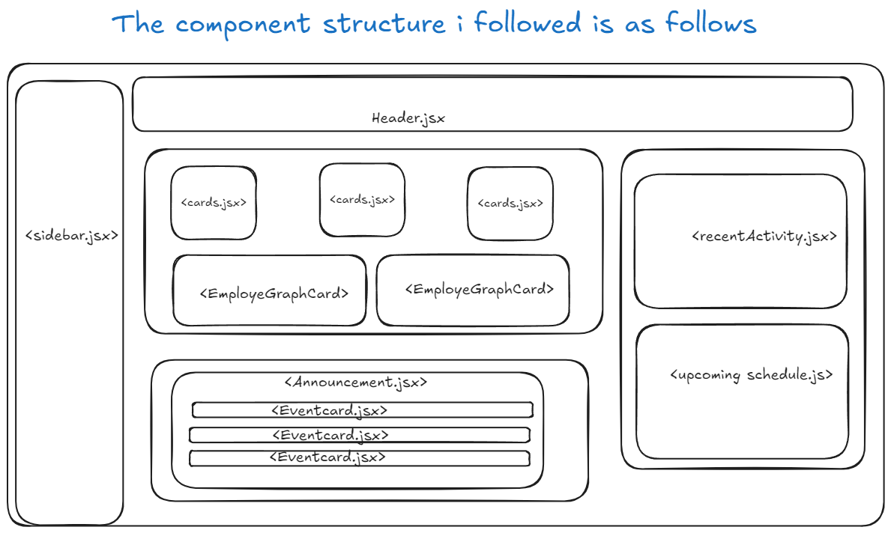
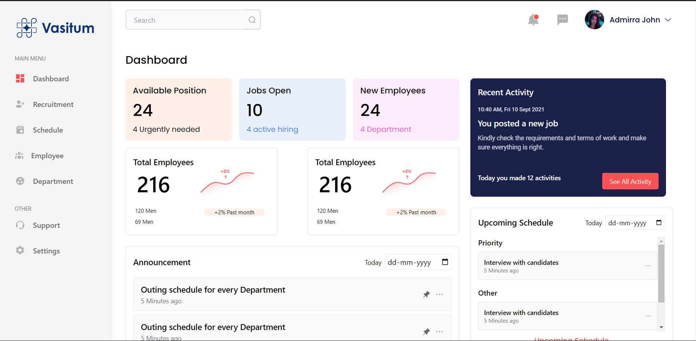
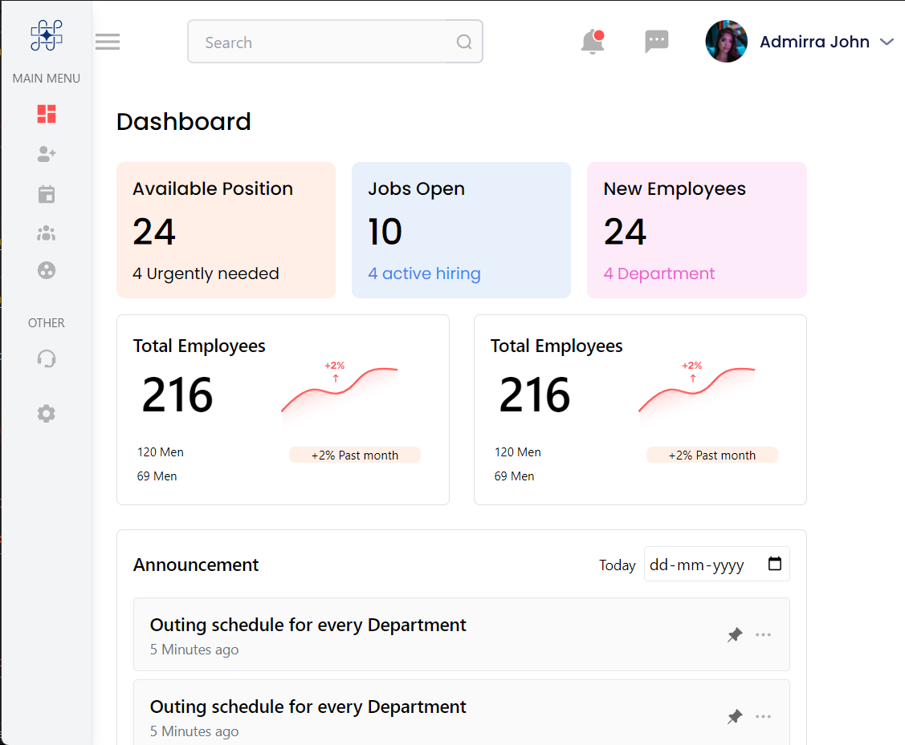

# Frontend Developer Intern - Technical Assignment

This project is a responsive web page built using React.js based on the provided [Figma design](https://tinyurl.com/mv5erx9j). It showcases reusable components, CSS styling, and responsiveness, optimized for both web and Tablet breakpoints. 

## 🚀 Project Structure

The folder structure for the project is as follows:

```
/Frontend
├── /public
│   └── index.html
├── /src
│   ├── /components
│   │   ├── Body
│   │   ├── Dashboard
│   │   ├── Header
│   │   ├── Sidebar
│   ├── /utils
│   │   └── Redux-store
│   │   └── Images
│   ├── App.js
│   ├── App.css
│   ├── index.js
│   └── (other files)
├── package.json
└── README.md
```

**Diagram of the structure**


**Full screen view**


**Tab sreen view**


## 🛠️ Technologies Used

- **React.js**: The entire app is built using React with the `create-react-app` tool for faster initialization.
- **CSS**: Styled using regular CSS to match the Figma design.
- **Redux**: Used this for state management.
- **Responsive Design**: Media queries were used to make the design responsive, optimized for web and Tabet views.
- **Vercel**: The project is hosted for live preview (link included below).


## ✨ Features

- **Reusable Components**: 

    - The components are dynamically rendered multiple times with different sets of data to display different views.
  
- **Responsive Layout**:
    - Ensured responsiveness using CSS media queries, tested and optimized for two breakpoints: **Web** and **Tablet** using **TAILWIND CSS**.
    - The layout and content automatically adjust based on the screen size, ensuring a seamless user experience on both desktop and Tablet devices.
  
- **Engaging UI**:
    - Followed modern UI design principles and incorporated visually appealing styles to maintain consistency with the Figma design.
  
## 🎨 Design Considerations

- **Web-first Approach**: Styled the components using a Web-first methodology, ensuring a smooth transition from Web to Tablet layouts.
- **Flexbox & Grid**: Utilized CSS Flexbox and Grid to manage component positioning and ensure a clean, responsive design.

## 🔥 How to Run Locally

1. Clone the repository:
   ```bash
   git clone https://github.com/Tusharpal353/Dashboard-task.git
   ```

2. Navigate into the project folder:
   ```bash
   cd Frontend
   ```

3. Install dependencies:
   ```bash
   npm install
   ```

4. Start the development server:
   ```bash
   npm start
   ```

5. Open your browser and go to `http://localhost:3000`.

## 🌍 Live Demo

Check out the hosted version of this project here: [Live Demo Link](https://dashboard-task-one.vercel.app/) (replace with actual link)

## 📈 Evaluation Metrics (Addressed)

- **Reusable Components**: used reusable components created and dynamically rendered.
- **Dynamic Rendering**: Different instances of the components display varying sets of data.
- **User Interface**: Designed a clean and visually engaging UI, responsive for both web and mobile devices.
- **Code Quality**: Followed best practices with well-structured and modular code, adhering to DRY (Don't Repeat Yourself) principles.

## 📦 Deployment

The project was deployed using vercel for a live preview, ensuring the final project is accessible and functional online.

## 💡 Additional Considerations

- Added hover states for better interactivity on desktop.
- Focused on performance optimization by structuring the CSS for faster rendering.
- Scalable component structure for potential future expansion or data binding if needed.


